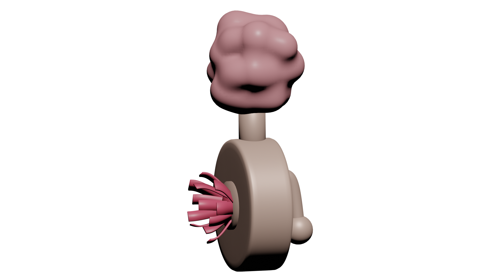
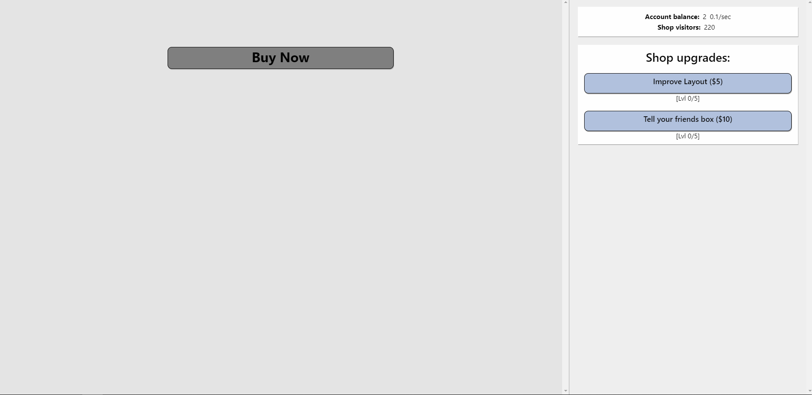
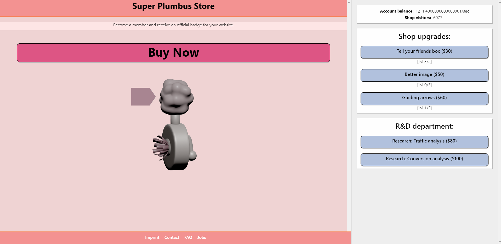

# gmtk-gamejam-2019
GMTK Game Jam 2019 running from 2nd to 4th August.

Topic: "Only One"

## Summary

- Genre: Clicker Game 
- Platform: Web Browser
- Technology: React

## Description

The "Only One" thing you always need is a Plumbus. It serves so many purposes, that we can't even exemplify. That is the reason why we came to the conclusion to build a clicker game for the GMTK 2019 GameJam.

The player is running and improving a webshop to attract more and more people for this item. Later in this game the webshop panel is loosing importance, because most actions will happen in the background.

## Remarks:

- Mouse Support
- Optimized for Google Chrome
- Prefered Resolution: 1920  x 1080

## Screenshots

| Rendering of a Plumbus | Webshop 1st tier | Webshop n-th tier |
|-------------------|---------------------|--------------------------|
|  |  |  |

